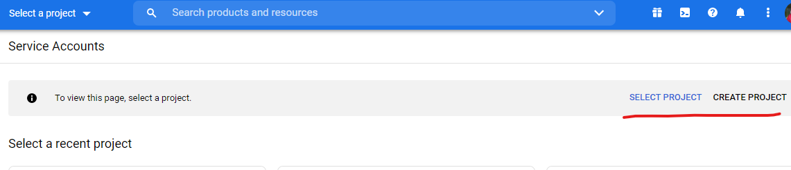
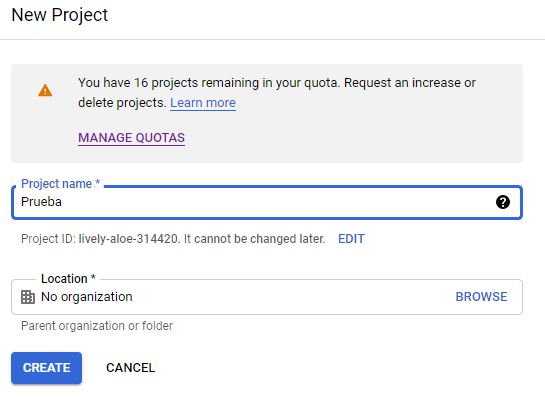
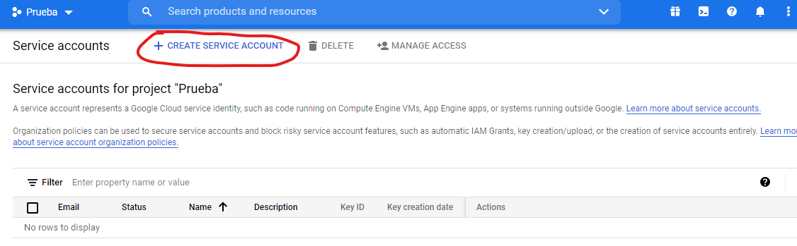
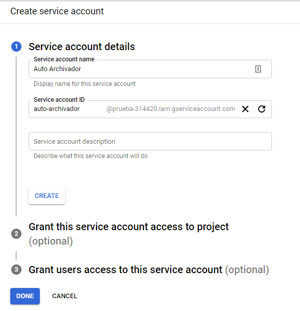
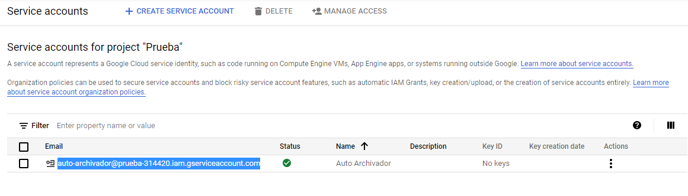
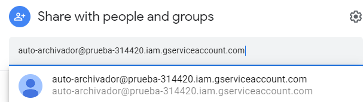
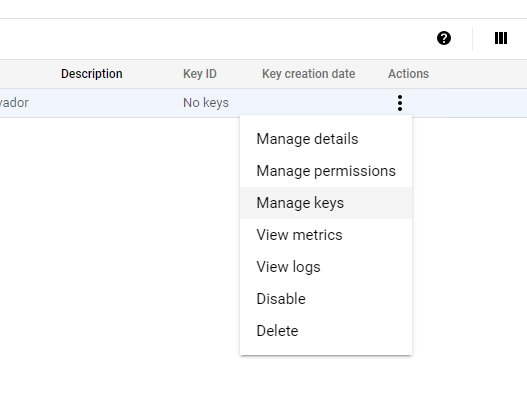
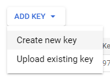
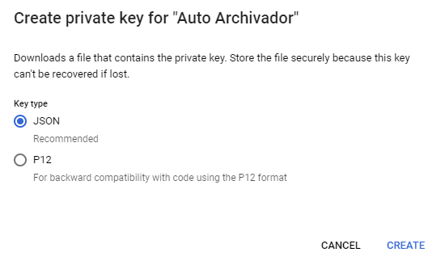

# Auto Archivador

Para una versión en Python, ver [auto-archiver](https://github.com/bellingcat/auto-archiver) de Bellingcat sobre el cual se basa este proyecto.

## Crear Service account en Google

Conectarse o registrarse con la misma cuenta que tiene capacidad de editar o invitar nuevos miembros a un archivo de Google Sheets en:

**[Service Accounts](https://console.cloud.google.com/iam-admin/serviceaccounts)**

1. **Create Project** para un proyecto nuevo o usar uno que ya tengan creado.



2. Nombrar el proyecto con el nombre que quieran.



3. Con el proyecto creado, clic en **"+ CREATE SERVICE ACCOUNT"**.



4. Darle un nombre al _service account_ y el resto de opciones se pueden dejar con las predeterminadas.



5. Copiar el email del service account que es como un usuario en si mismo.



6. En el Google Sheets que queremos usar junto a esta aplicación, picar en "Share" y agregar el email del service account a la lista de usuarios con capacidad de editar la tabla. (De la misma forma que invitamos a cualquier usuario a la tabla).



7. Volver al service account (desde donde copias el email en el punto 5) y picar en los 3 puntos a la derecha para crear un nuevo Key desde **"Manage keys"**.



8. En la nueva ventana picar en **Add Key -> Create new key** y luego seleccionar la opción de JSON. Por último picar en **"Create"** y se va a descargar un archivo `xxxxx.json` en su computador.





9. Copiar ese archivo a la carpeta `./secretos/`

```sh
./secretos/xxxxx.json
```

10. Cambiar el nombre del archivo `.env.ejemplo` por `.env` y poner el nombre de nuestro archivo `.json`

```sh
SECRETOS="xxxxx.json"
```

### :exclamation: **NO COMPARTIR O SUBIR A GIT ESTE ARCHIVO `xxxxx.json`** :exclamation:
